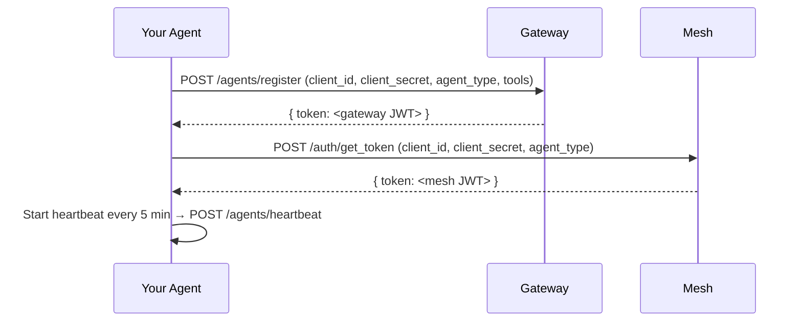

`MeshConnector` connects a running `Agent` to the Svantic platform. It handles gateway registration, mesh authentication, and periodic heartbeats — the three concerns that make a standalone agent visible to the Svantic orchestrator. Import from `@svantic/sdk/mesh`.

```typescript
import { MeshConnector } from '@svantic/sdk/mesh';
```

<Note>
`MeshConnector` is entirely separate from `Agent`. You can run an `Agent` standalone without ever calling `MeshConnector`. Only add it when you need your agent registered in a Svantic deployment.
</Note>

## Registration flow

When you call `connect()`, the following steps execute in order:



On `disconnect()`:

1. Heartbeat timer is stopped.
2. `POST /agents/deregister` is sent to the gateway (best-effort — does not throw on failure).
3. Both tokens are cleared and `connected` is set to `false`.

---

## Constructor

```typescript
import { MeshConnector } from '@svantic/sdk/mesh';

const mesh = new MeshConnector(agent: Agent, config: MeshConnectorConfig);
```

### MeshConnectorConfig

<ParamField body="gateway_url" type="string" required>
  URL of the Svantic Gateway service, for example `https://gateway.svantic.com`. Trailing slashes are stripped. The Gateway persists agent registrations and returns a gateway JWT.
</ParamField>

<ParamField body="mesh_url" type="string" required>
  URL of the Svantic Mesh node, for example `https://mesh.svantic.com`. Trailing slashes are stripped. The Mesh handles session operations and token exchange.
</ParamField>

<ParamField body="client_id" type="string" required>
  Tenant client ID. Identifies your tenant during registration and token exchange. Find this in the dashboard under **Settings → API Keys**.
</ParamField>

<ParamField body="client_secret" type="string" required>
  Tenant client secret. Combined with `client_id` to authenticate both the gateway registration and the mesh token exchange.
</ParamField>

<ParamField body="retries" type="number" default="3">
  Number of retry attempts for the gateway registration request on failure.
</ParamField>

<ParamField body="retry_delay_ms" type="number" default="2000">
  Delay in milliseconds between registration retry attempts.
</ParamField>

<Warning>
Never hardcode `client_id` and `client_secret` in source code. Read them from environment variables or a secrets manager at runtime.
</Warning>

**Example**

```typescript
import { Agent } from '@svantic/sdk';
import { MeshConnector } from '@svantic/sdk/mesh';
import express from 'express';

const app = express();
const agent = new Agent({
  name: 'invoice-processor',
  description: 'Extracts data from invoice documents.',
  url: 'http://localhost:4000',
});

agent.define_capability({ /* ... */ });
agent.expose(app);
app.listen(4000);

const mesh = new MeshConnector(agent, {
  gateway_url: process.env.SVANTIC_GATEWAY_URL!,
  mesh_url: process.env.SVANTIC_MESH_URL!,
  client_id: process.env.SVANTIC_CLIENT_ID!,
  client_secret: process.env.SVANTIC_CLIENT_SECRET!,
  retries: 5,
  retry_delay_ms: 3000,
});

await mesh.connect();
console.log('Agent registered. Mesh token:', mesh.token?.slice(0, 20) + '...');
```

---

## Methods

### `connect(): Promise<void>`

Register with the gateway and authenticate with the mesh. Starts the heartbeat timer on success.

```typescript
async connect(): Promise<void>
```

This method throws if gateway registration fails after all retry attempts. The error message includes the number of attempts and the last HTTP error detail.

---

### `disconnect(): Promise<void>`

Stop the heartbeat, send a deregister request to the gateway, and clear stored tokens. Safe to call on shutdown even if `connect()` was never called — exits immediately when `connected` is `false`.

```typescript
async disconnect(): Promise<void>
```

The deregister request is best-effort. If the gateway is unreachable at shutdown, `disconnect()` still completes without throwing.

**Shutdown pattern**

```typescript
const shutdown = async () => {
  await mesh.disconnect();
  await agent.close();
  process.exit(0);
};

process.on('SIGTERM', shutdown);
process.on('SIGINT', shutdown);
```

---

## Properties

<ResponseField name="connected" type="boolean">
  `true` when `connect()` has completed successfully and `disconnect()` has not been called.
</ResponseField>

<ResponseField name="gateway_url" type="string">
  The gateway URL this connector is configured for (trailing slashes stripped).
</ResponseField>

<ResponseField name="mesh_url" type="string">
  The mesh URL this connector is configured for (trailing slashes stripped).
</ResponseField>

<ResponseField name="token" type="string | null">
  The mesh JWT for session operations. Available after `connect()` succeeds; `null` before that or after `disconnect()`.
</ResponseField>

<ResponseField name="agent" type="Agent">
  The `Agent` instance this connector is bound to.
</ResponseField>

---

## MeshAuth

`MeshAuth` is a stateless helper that handles credential exchange with a Svantic mesh node directly. `MeshConnector` calls it internally, but you can also use it standalone — for example, to obtain a token for use with `RemoteAgent.connect()`.

Import from `@svantic/sdk/mesh`:

```typescript
import { MeshAuth } from '@svantic/sdk/mesh';
```

### `MeshAuth.get_token(mesh_url, credentials, options?): Promise<string>`

Exchange client credentials for a signed mesh JWT.

```typescript
static async get_token(
  mesh_url: string,
  credentials: MeshCredentials,
  options?: TokenExchangeOptions,
): Promise<string>
```

<ParamField body="mesh_url" type="string" required>
  URL of the Svantic Mesh node, for example `https://mesh.svantic.com`.
</ParamField>

<ParamField body="credentials" type="MeshCredentials" required>
  Credential bundle for the token exchange.

  ```typescript
  interface MeshCredentials {
    client_id: string;     // Tenant client ID
    client_secret: string; // Tenant client secret
    agent_type: string;    // Logical agent type embedded in JWT claims
  }
  ```
</ParamField>

<ParamField body="options" type="TokenExchangeOptions">
  Retry configuration.

  ```typescript
  interface TokenExchangeOptions {
    retries?: number;        // Default: 3
    retry_delay_ms?: number; // Default: 2000
  }
  ```
</ParamField>

Returns the signed JWT string. Throws after all retry attempts are exhausted.

**Example: obtain a token for RemoteAgent**

```typescript
import { MeshAuth } from '@svantic/sdk/mesh';
import { RemoteAgent } from '@svantic/sdk';

const token = await MeshAuth.get_token(process.env.SVANTIC_MESH_URL!, {
  client_id: process.env.SVANTIC_CLIENT_ID!,
  client_secret: process.env.SVANTIC_CLIENT_SECRET!,
  agent_type: 'my-orchestrator',
});

const remoteAgent = await RemoteAgent.connect('https://agent.your-domain.com', token);
```

---

## MeshSpanExporter

`MeshSpanExporter` is re-exported from `@svantic/sdk/mesh` as a convenience. It ships from `@svantic/telemetry` and exports OTEL spans to the mesh for centralized observability.

```typescript
import { MeshSpanExporter } from '@svantic/sdk/mesh';
```

Pass it to `SvanticTelemetry.init()` as the `export` option:

```typescript
import { SvanticTelemetry } from '@svantic/sdk/telemetry';
import { MeshSpanExporter } from '@svantic/sdk/mesh';

const telemetry = SvanticTelemetry.init({
  service_name: 'my-agent',
  instance_id: 'pod-abc',
  export: new MeshSpanExporter({ endpoint: process.env.SVANTIC_MESH_URL + '/telemetry' }),
});
```

See the `@svantic/telemetry` documentation for full `MeshSpanExporter` configuration options.

---

## Type reference

### `MeshConnectorConfig`

```typescript
interface MeshConnectorConfig {
  gateway_url: string;
  mesh_url: string;
  client_id: string;
  client_secret: string;
  retries?: number;
  retry_delay_ms?: number;
}
```

### `MeshCredentials`

```typescript
interface MeshCredentials {
  client_id: string;
  client_secret: string;
  agent_type: string;
}
```

### `TokenExchangeOptions`

```typescript
interface TokenExchangeOptions {
  retries?: number;
  retry_delay_ms?: number;
}
```
